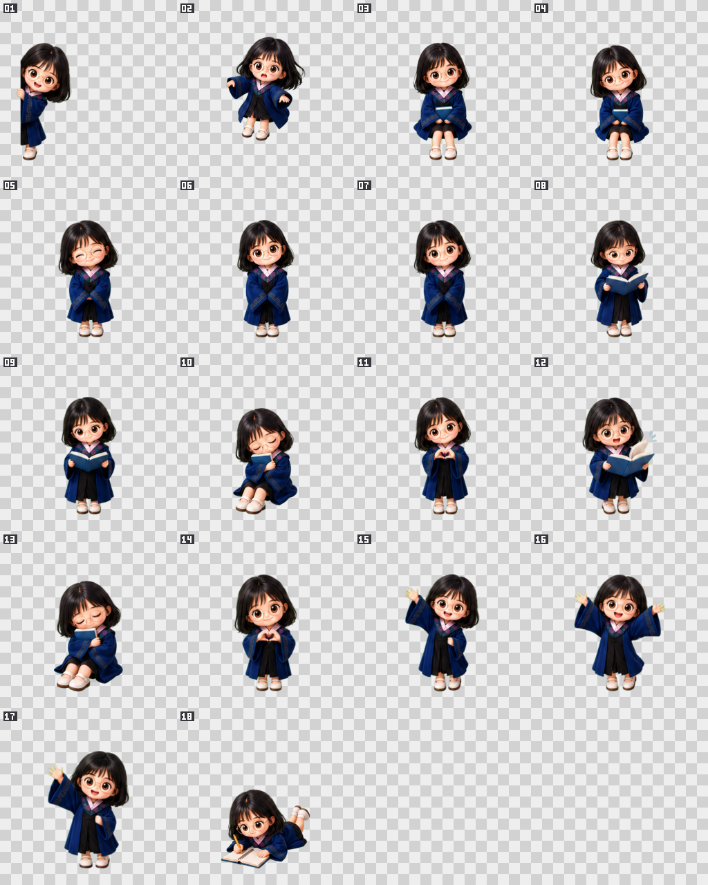

# 桌宠 v0.3.0（Windows）

这是一个基于 .NET 8 与 WPF 的透明桌面宠物。v0.3.0 在 v0.2.0 素材契约上改为动作直接切换：不播放启动、进入、退出或落地转场。待机、坐姿、阅读、睡眠和写字直接进入循环；爱心、招手与下落结束后直接返回待机。



## 运行

要求：Windows 10/11 x64、[.NET 8 Desktop Runtime x64](https://dotnet.microsoft.com/download/dotnet/8.0)。开发和构建还需要 .NET 8 SDK 与 Python 3.11+；项目不依赖第三方 NuGet 或 Python 包。

开发环境直接运行：

```powershell
dotnet run --project src/DesktopPet.App/DesktopPet.App.csproj
```

发布包中双击 `DesktopPet.exe`。程序采用单实例模式；再次启动会唤回已经运行的桌宠。大小、透明度、行为和窗口位置统一保存在 `%LOCALAPPDATA%\DesktopPet\settings.json`，更新时保留 `.bak`。

## 交互

- 单击人物：在爱心和挥手反馈之间切换。
- 按住人物拖动：进入伸手姿势；释放后播放下落回弹。
- 托盘菜单：调整大小、透明度、置顶、位置锁定、点击区域、动作频率、减少动态效果和开机启动。
- 双击托盘图标：恢复桌宠控制。
- `Ctrl+Alt+Shift+P`：全局恢复热键，可从完全穿透模式退出。

点击区域有三种模式：默认只让人物的非透明像素接收点击；整个窗口可点击；完全点击穿透。完全穿透时请使用托盘菜单或恢复热键找回控制。Debug 构建的托盘菜单另有动作选择器，Release 构建不显示。

## 18 个姿势

| 编号 | 语义 ID | 用途 |
| ---: | --- | --- |
| 01 | `peek.screen_left` | 从屏幕边缘探头 |
| 02 | `falling.reach` | 拖拽、下落与回弹 |
| 03 | `sit.edge_idle` | 坐姿待机 |
| 04 | `sit.edge_alt` | 坐姿变化 |
| 05 | `idle.blink_smile` | 闭眼微笑、眨眼 |
| 06 | `idle.neutral` | 标准待机与比例母版 |
| 07 | `idle.alt` | 待机变化 |
| 08 | `read.small` | 小书阅读 |
| 09 | `read.hold` | 持书阅读 |
| 10 | `sleep.seated` | 坐着睡觉 |
| 11 | `heart` | 爱心手势 |
| 12 | `read.surprised` | 阅读惊喜 |
| 13 | `sleep.seated_alt` | 睡姿变化 |
| 14 | `heart.raise` | 爱心抬起变化 |
| 15 | `wave.single_a` | 单手挥动 A |
| 16 | `cheer.both_hands` | 双手欢呼 |
| 17 | `wave.single_b` | 单手挥动 B |
| 18 | `write.prone` | 趴着写字 |

18 张图片是身份与关键姿势母版。`assets/manifest/animations.json` 保留 20 个片段、160 帧作为素材归档和故障兼容，但 v0.3.0 正常调度只使用 9 个直接动作片段，不调用任何 `.enter`、`.exit`、`boot.enter` 或 `landing.play`。活动帧以约 12fps 切换，呼吸缩放限制在 `±0.5%`；“减少动态效果”继续只显示各状态的关键姿势。

## 验证与构建

完整验证会依次执行素材 lint、Python 单元测试、Core 清单/时间线/优先级冒烟测试和 Release 解决方案构建；解决方案同时编译原生窗口验收程序：

```powershell
powershell -ExecutionPolicy Bypass -File scripts/verify.ps1
```

仅跳过最后的解决方案构建：

```powershell
powershell -ExecutionPolicy Bypass -File scripts/verify.ps1 -SkipBuild
```

手动 Release 构建：

```powershell
dotnet build DesktopPet.sln --configuration Release
```

在可交互 Windows 桌面会话中，可运行原生窗口验收，检查窗口样式和人物/透明区域的 `WM_NCHITTEST`：

```powershell
dotnet run --project tests/DesktopPet.Integration/DesktopPet.Integration.csproj -- `
  --exe src/DesktopPet.App/bin/Release/net8.0-windows/DesktopPet.exe `
  --manifest assets/manifest/assets.json
```

运行前请先退出已有桌宠实例；测试程序会启动并在结束时关闭自己的桌宠进程。

## 发布

发布脚本先执行完整验证，然后生成 `win-x64`、framework-dependent 的便携目录和 ZIP；不需要 7-Zip 等外部打包程序。

```powershell
powershell -ExecutionPolicy Bypass -File scripts/publish.ps1 -Version 0.3.0
```

产物位于 `dist/DesktopPet-0.3.0-win-x64/` 和 `dist/DesktopPet-0.3.0-win-x64.zip`。目标电脑需要 .NET 8 Desktop Runtime x64。查看将要使用的路径而不写入或删除文件：

```powershell
powershell -ExecutionPolicy Bypass -File scripts/publish.ps1 -Version 0.3.0 -DryRun
```

生成当前用户安装程序（默认安装到 `%LOCALAPPDATA%\Programs\DesktopPet`）：

```powershell
powershell -ExecutionPolicy Bypass -File scripts/build-installer.ps1 -Version 0.3.0
```

安装程序支持安全更新、开始菜单入口、Windows“已安装的应用”卸载项，并在卸载时保留 `%LOCALAPPDATA%\DesktopPet` 中的个人设置。安装器和应用均为 framework-dependent，目标电脑需要 .NET 8 Desktop Runtime x64。当前原型未做代码签名，首次运行时 Windows 可能显示未知发布者提示。

最终文件校验值见 [SHA256SUMS.txt](dist/SHA256SUMS.txt)。v0.3.0 发布使用 `-Version 0.3.0`。

素材生产与校验细节见 [tools/README.md](tools/README.md)，总体里程碑见 [DESKTOP_PET_PLAN.md](DESKTOP_PET_PLAN.md)。

## 素材和授权说明

关键姿势位于 `assets/sprites/`，逐帧素材位于 `assets/animations/`；两套清单分别为 `assets.json` 与 `animations.json`。逐帧清单损坏或缺帧时程序会自动退回 18 姿势模式。原始拼图或棋盘格参考图不能直接作为运行时透明精灵使用。发布或商业使用前，请自行确认角色设计和生成素材具备相应授权。
